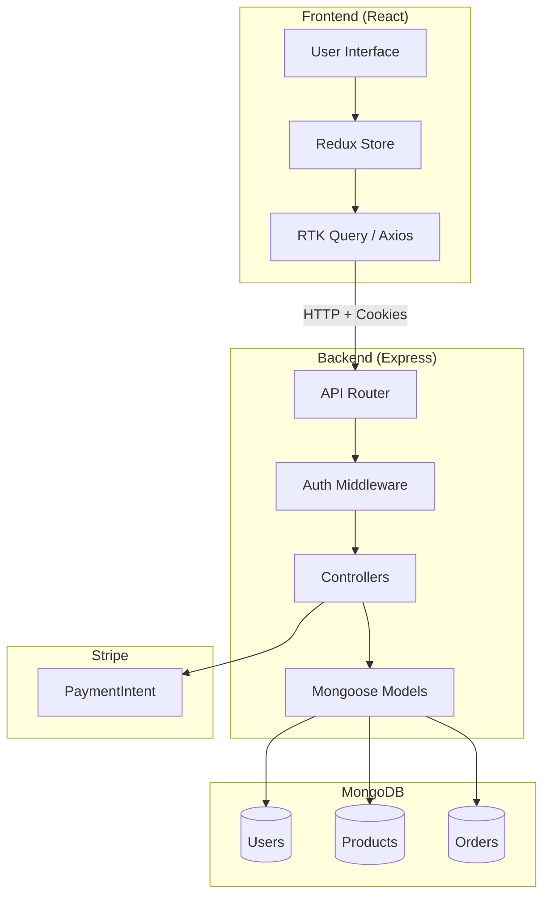
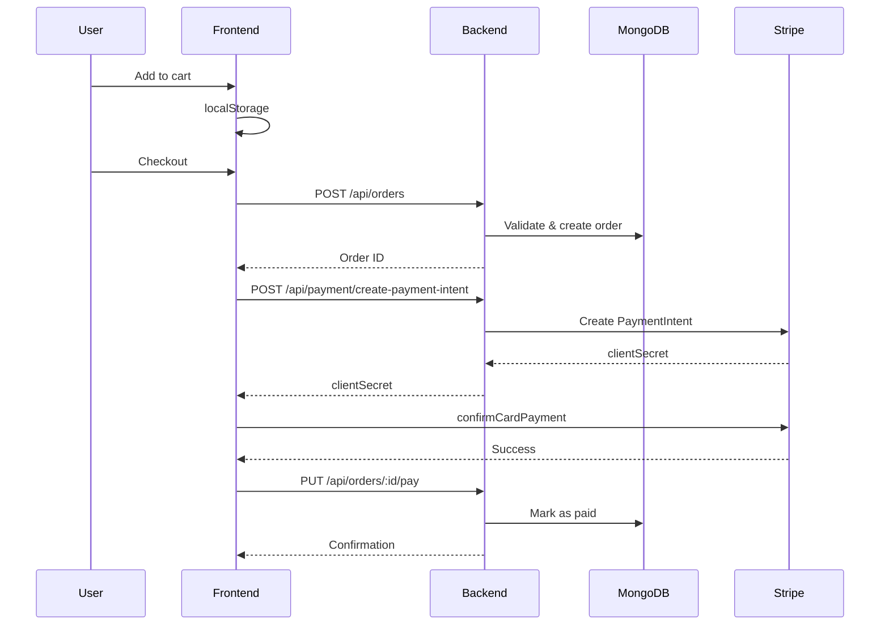

# Kore E-Commerce Backend Sync Prompt

This document describes the backend API requirements to fully support the Kore E-Commerce frontend.

---

## System Architecture



## Order & Payment Flow



---

## Technology Stack
- **Runtime**: Node.js with Express.js
- **Database**: MongoDB with Mongoose
- **Authentication**: JWT with HTTP-only cookies (access token + refresh token)
- **Payments**: Stripe
- **Password Hashing**: bcrypt (salt rounds: 12)

---

## Data Models

### User
```javascript
{
  _id: ObjectId,
  name: String (required),
  email: String (required, unique),
  password: String (required, hashed with bcrypt),
  role: String (enum: ['user', 'admin'], default: 'user'),
  createdAt: Date,
  updatedAt: Date
}
```

### Product
```javascript
{
  _id: ObjectId,
  name: String (required),
  description: String,
  price: Number (required),
  category: String (required),
  images: [String] (required, array of URLs),
  stock: Number (required, default: 0),
  isActive: Boolean (default: true),
  createdAt: Date,
  updatedAt: Date
}
```

### Order
```javascript
{
  _id: ObjectId,
  user: ObjectId (ref: 'User'),
  orderItems: [{
    product: ObjectId (ref: 'Product'),
    name: String,
    qty: Number,
    price: Number,
    image: String
  }],
  shippingAddress: {
    address: String,
    city: String,
    postalCode: String,
    country: String
  },
  paymentMethod: String,
  taxPrice: Number,
  shippingPrice: Number,
  totalPrice: Number,
  isPaid: Boolean (default: false),
  paidAt: Date,
  paymentResult: {
    id: String,
    status: String,
    update_time: String,
    email_address: String
  },
  isDelivered: Boolean (default: false),
  deliveredAt: Date,
  createdAt: Date
}
```

---

## API Endpoints

### Response Format
All endpoints return:
```javascript
{
  success: true,
  data: { ... },
  message?: string
}
```

Error responses:
```javascript
{
  success: false,
  message: "Error description",
  errors?: [{ field: string, message: string }]
}
```

---

### Authentication Routes

| Method | Route | Description | Auth |
|--------|-------|-------------|------|
| `POST` | `/api/auth/register` | Register new user | No |
| `POST` | `/api/auth/login` | Login, set cookies | No |
| `POST` | `/api/auth/logout` | Clear cookies | Yes |
| `GET` | `/api/auth/me` | Get current user | Yes |
| `POST` | `/api/auth/refresh` | Refresh access token | Cookie |

**Cookie Configuration:**
```javascript
// Access Token Cookie
res.cookie('accessToken', token, {
  httpOnly: true,
  secure: process.env.NODE_ENV === 'production',
  sameSite: 'lax',
  maxAge: 15 * 60 * 1000  // 15 minutes
});

// Refresh Token Cookie
res.cookie('refreshToken', refreshToken, {
  httpOnly: true,
  secure: process.env.NODE_ENV === 'production',
  sameSite: 'lax',
  maxAge: 7 * 24 * 60 * 60 * 1000  // 7 days
});
```

---

### User Routes

| Method | Route | Description | Auth |
|--------|-------|-------------|------|
| `PUT` | `/api/users/profile` | Update user profile | Yes |

**Request Body:**
```javascript
{ name?: string, password?: string }
```

---

### Product Routes

| Method | Route | Description | Auth |
|--------|-------|-------------|------|
| `GET` | `/api/products` | List products (cursor pagination) | No |
| `GET` | `/api/products/:id` | Get single product | No |
| `POST` | `/api/products` | Create product | Admin |
| `PUT` | `/api/products/:id` | Update product | Admin |
| `DELETE` | `/api/products/:id` | Delete product | Admin |

**GET /api/products Response:**
```javascript
{
  success: true,
  data: {
    data: [...products],
    pagination: {
      hasMore: boolean,
      nextCursor: string | null
    }
  }
}
```

**POST /api/products Request:**
```javascript
{
  name: string,
  description?: string,
  price: number,
  category: string,
  images: string[],
  stock: number
}
```

---

### Order Routes

| Method | Route | Description | Auth |
|--------|-------|-------------|------|
| `POST` | `/api/orders` | Create order | Yes |
| `GET` | `/api/orders/myorders` | Get user's orders | Yes |
| `GET` | `/api/orders/:id` | Get order by ID | Yes |
| `GET` | `/api/orders` | Get all orders | Admin |
| `PUT` | `/api/orders/:id/pay` | Mark order as paid | Yes |
| `PUT` | `/api/orders/:id/deliver` | Mark as delivered | Admin |

**POST /api/orders Request:**
```javascript
{
  orderItems: [{
    product: string,  // Product _id
    name: string,
    qty: number,
    price: number,
    image: string
  }],
  shippingAddress: {
    address: string,
    city: string,
    postalCode: string,
    country: string
  },
  paymentMethod: string,
  taxPrice: number,
  shippingPrice: number,
  totalPrice: number
}
```

**PUT /api/orders/:id/pay Request:**
```javascript
{
  id: string,           // Stripe Payment Intent ID
  status: string,
  update_time: string,
  email_address: string
}
```

---

### Payment Routes (Stripe)

| Method | Route | Description | Auth |
|--------|-------|-------------|------|
| `GET` | `/api/config/stripe` | Get publishable key | No |
| `POST` | `/api/payment/create-payment-intent` | Create payment intent | Yes |

**GET /api/config/stripe Response:**
```javascript
{ success: true, data: { publishableKey: "pk_test_..." } }
```

**POST /api/payment/create-payment-intent Request:**
```javascript
{ orderId: string }
```

**Response:**
```javascript
{ success: true, data: { clientSecret: "pi_..." } }
```

---

## Middleware

### Auth Middleware
```javascript
// Verify access token from cookies
const authMiddleware = async (req, res, next) => {
  const token = req.cookies.accessToken;
  if (!token) return res.status(401).json({ success: false, message: 'Not authorized' });
  
  try {
    const decoded = jwt.verify(token, process.env.JWT_SECRET);
    req.user = await User.findById(decoded.id).select('-password');
    next();
  } catch (error) {
    res.status(401).json({ success: false, message: 'Token invalid' });
  }
};
```

### Admin Middleware
```javascript
const adminMiddleware = (req, res, next) => {
  if (req.user?.role !== 'admin') {
    return res.status(403).json({ success: false, message: 'Admin access required' });
  }
  next();
};
```

---

## CORS Configuration

```javascript
app.use(cors({
  origin: 'http://localhost:5173',  // Vite dev server
  credentials: true  // Required for cookies
}));
```

---

## Environment Variables

```env
PORT=5000
MONGODB_URI=mongodb://localhost:27017/kore
JWT_ACCESS_SECRET=your-super-secret-jwt-key
JWT_REFRESH_SECRET=your-refresh-token-secret
STRIPE_SECRET_KEY=sk_test_...
STRIPE_PUBLISHABLE_KEY=pk_test_...
NODE_ENV=development
```

---

## Test Accounts (After Seeding)

| Role | Email | Password |
|------|-------|----------|
| Admin | `admin@kore.com` | `Admin123!` |
| User | `user@test.com` | `User123!` |

> [!TIP]
> Run `npm run seed` to populate the database with sample users, products, and an order.
