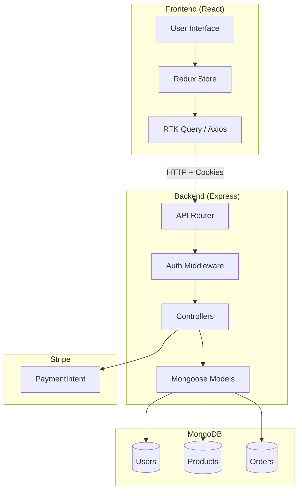
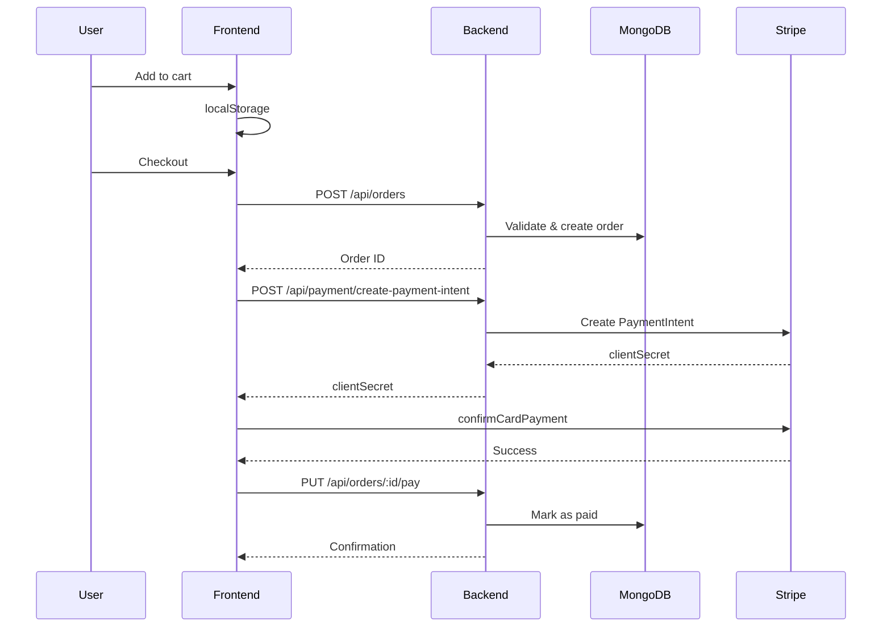

# Frontend Sync Prompt for Kore E-Commerce

> **CRITICAL**: Use this document when implementing the frontend to ensure all API calls match the backend exactly. Route mismatches will cause failures.

---

## System Architecture



## Order & Payment Flow



---

## Base Configuration

```javascript
// All API calls use this base URL
const API_BASE_URL = 'http://localhost:5000/api';

// CRITICAL: Include credentials for cookie-based auth
const fetchConfig = {
  credentials: 'include', // Required for httpOnly cookies
  headers: {
    'Content-Type': 'application/json'
  }
};
```

> [!CAUTION]
> **Cookie-Based Authentication**: This backend uses `httpOnly` cookies, NOT Bearer tokens. You MUST set `credentials: 'include'` on ALL fetch requests. There is NO Authorization header.

---

## Authentication API

All auth routes use cookies automatically. Login/Register set cookies in the response.

### Register User
```http
POST /api/auth/register
Content-Type: application/json

{
  "email": "user@example.com",
  "password": "Password123!",
  "name": "John Doe"
}
```

**Response (201):**
```json
{
  "success": true,
  "message": "Registration successful",
  "data": {
    "user": {
      "id": "user_id",
      "email": "user@example.com",
      "name": "John Doe",
      "role": "user"
    }
  }
}
```

---

### Login
```http
POST /api/auth/login
Content-Type: application/json

{
  "email": "user@example.com",
  "password": "Password123!"
}
```

**Response (200):**
```json
{
  "success": true,
  "message": "Login successful",
  "data": {
    "user": {
      "id": "user_id",
      "email": "user@example.com",
      "name": "John Doe",
      "role": "user"
    }
  }
}
```

---

### Get Current User
```http
GET /api/auth/me
```

**Response (200):**
```json
{
  "success": true,
  "data": {
    "user": {
      "id": "user_id",
      "email": "user@example.com",
      "name": "John Doe",
      "role": "user",
      "createdAt": "2024-01-01T00:00:00.000Z"
    }
  }
}
```

---

### Logout
```http
POST /api/auth/logout
```

**Response (200):**
```json
{
  "success": true,
  "message": "Logout successful"
}
```

---

### Refresh Token
```http
POST /api/auth/refresh
```
> Called automatically when access token expires. Uses `refreshToken` cookie.

---

## User Profile API

### Update Profile
```http
PUT /api/users/profile
Content-Type: application/json

{
  "name": "Updated Name",
  "password": "NewPassword123!" // Optional
}
```

**Response (200):**
```json
{
  "success": true,
  "message": "Profile updated successfully",
  "data": {
    "user": {
      "id": "user_id",
      "email": "user@example.com",
      "name": "Updated Name",
      "role": "user"
    }
  }
}
```

---

## Products API

### Get Products (with Cursor Pagination)
```http
GET /api/products?limit=10&cursor=optional_cursor
```

**Response (200):**
```json
{
  "success": true,
  "data": {
    "data": [
      {
        "_id": "product_id",
        "name": "Product Name",
        "description": "...",
        "price": 29.99,
        "category": "Electronics",
        "stock": 50,
        "images": ["url1.jpg"],
        "isActive": true,
        "createdAt": "2024-01-01T00:00:00.000Z"
      }
    ],
    "pagination": {
      "nextCursor": "next_cursor_id",
      "hasMore": true,
      "limit": 10
    }
  }
}
```

---

### Get Single Product
```http
GET /api/products/:id
```

---

## Orders API

> [!IMPORTANT]
> All order endpoints require authentication (cookies must be sent).

### Create Order
```http
POST /api/orders
Content-Type: application/json

{
  "orderItems": [
    {
      "product": "product_id",
      "name": "Product Name",
      "qty": 2,
      "price": 29.99,
      "image": "product_image_url.jpg"
    }
  ],
  "shippingAddress": {
    "address": "123 Main St",
    "city": "New York",
    "postalCode": "10001",
    "country": "USA"
  },
  "paymentMethod": "stripe",
  "taxPrice": 5.00,
  "shippingPrice": 10.00,
  "totalPrice": 74.98
}
```

**Response (201):**
```json
{
  "success": true,
  "message": "Order created successfully",
  "data": {
    "order": {
      "_id": "order_id",
      "user": "user_id",
      "orderItems": [...],
      "shippingAddress": {...},
      "paymentMethod": "stripe",
      "taxPrice": 5.00,
      "shippingPrice": 10.00,
      "totalPrice": 74.98,
      "isPaid": false,
      "isDelivered": false,
      "createdAt": "2024-01-01T00:00:00.000Z"
    }
  }
}
```

> [!WARNING]
> Stock is decremented when the order is created. If stock is insufficient, return `400 Bad Request`.

---

### Get My Orders
```http
GET /api/orders/myorders
```

**Response (200):**
```json
{
  "success": true,
  "data": {
    "orders": [
      {
        "_id": "order_id",
        "totalPrice": 74.98,
        "isPaid": false,
        "isDelivered": false,
        "createdAt": "2024-01-01T00:00:00.000Z"
      }
    ]
  }
}
```

---

### Get Order by ID
```http
GET /api/orders/:id
```

**Response (200):**
```json
{
  "success": true,
  "data": {
    "order": {
      "_id": "order_id",
      "user": {
        "_id": "user_id",
        "name": "John Doe",
        "email": "user@example.com"
      },
      "orderItems": [...],
      "shippingAddress": {...},
      "paymentMethod": "stripe",
      "taxPrice": 5.00,
      "shippingPrice": 10.00,
      "totalPrice": 74.98,
      "isPaid": false,
      "paidAt": null,
      "isDelivered": false,
      "deliveredAt": null,
      "paymentResult": null,
      "createdAt": "2024-01-01T00:00:00.000Z"
    }
  }
}
```

---

### Update Order to Paid
```http
PUT /api/orders/:id/pay
Content-Type: application/json

{
  "id": "stripe_payment_intent_id",
  "status": "succeeded",
  "update_time": "2024-01-01T12:00:00.000Z",
  "email_address": "payer@email.com"
}
```

**Response (200):**
```json
{
  "success": true,
  "message": "Order marked as paid",
  "data": {
    "order": {
      "_id": "order_id",
      "isPaid": true,
      "paidAt": "2024-01-01T12:00:00.000Z",
      "paymentResult": {
        "id": "stripe_payment_intent_id",
        "status": "succeeded",
        "update_time": "2024-01-01T12:00:00.000Z",
        "email_address": "payer@email.com"
      }
    }
  }
}
```

---

### Get All Orders (Admin Only)
```http
GET /api/orders
```

---

## Payment API (Stripe)

### Get Stripe Publishable Key
```http
GET /api/config/stripe
```

**Response (200):**
```json
{
  "success": true,
  "data": {
    "publishableKey": "pk_test_..."
  }
}
```

---

### Create Payment Intent
```http
POST /api/payment/create-payment-intent
Content-Type: application/json

{
  "orderId": "order_id"
}
```

**Response (200):**
```json
{
  "success": true,
  "data": {
    "clientSecret": "pi_xxx_secret_xxx"
  }
}
```

> [!TIP]
> Use this `clientSecret` with Stripe.js `confirmCardPayment()` method.

---

## Error Response Format

All errors follow this structure:

```json
{
  "success": false,
  "message": "Error message",
  "errors": [
    {
      "field": "email",
      "message": "Invalid email format"
    }
  ]
}
```

**HTTP Status Codes:**
- `400` - Bad Request (validation errors)
- `401` - Unauthorized (not logged in / token expired)
- `403` - Forbidden (insufficient permissions)
- `404` - Not Found
- `500` - Server Error

---

## Frontend Implementation Notes

### 1. RTK Query / Axios Setup

```javascript
// api/apiSlice.js
import { createApi, fetchBaseQuery } from '@reduxjs/toolkit/query/react';

export const apiSlice = createApi({
  baseQuery: fetchBaseQuery({
    baseUrl: 'http://localhost:5000/api',
    credentials: 'include', // CRITICAL!
  }),
  tagTypes: ['User', 'Product', 'Order'],
  endpoints: () => ({}),
});
```

### 2. Token Refresh Interceptor

Implement an interceptor to call `POST /api/auth/refresh` when you receive a `401` response with message "Access token expired":

```javascript
// Example with Axios
axios.interceptors.response.use(
  (response) => response,
  async (error) => {
    if (error.response?.status === 401 && 
        error.response?.data?.message === 'Access token expired') {
      await axios.post('/api/auth/refresh', {}, { withCredentials: true });
      return axios(error.config); // Retry original request
    }
    return Promise.reject(error);
  }
);
```

### 3. Protected Routes

Check if user is authenticated before allowing access:

```jsx
// ProtectedRoute.jsx
const ProtectedRoute = ({ children }) => {
  const { data: user, isLoading } = useGetMeQuery();
  
  if (isLoading) return <Spinner />;
  if (!user) return <Navigate to="/login" />;
  
  return children;
};
```

### 4. Stripe Integration

```jsx
import { loadStripe } from '@stripe/stripe-js';
import { Elements, CardElement, useStripe, useElements } from '@stripe/react-stripe-js';

// Fetch publishable key from backend
const stripePromise = fetch('/api/config/stripe')
  .then(res => res.json())
  .then(({ data }) => loadStripe(data.publishableKey));

// Payment form component
const PaymentForm = ({ orderId, onSuccess }) => {
  const stripe = useStripe();
  const elements = useElements();

  const handleSubmit = async (e) => {
    e.preventDefault();
    
    // 1. Create PaymentIntent
    const { data } = await fetch('/api/payment/create-payment-intent', {
      method: 'POST',
      credentials: 'include',
      headers: { 'Content-Type': 'application/json' },
      body: JSON.stringify({ orderId })
    }).then(r => r.json());
    
    // 2. Confirm payment
    const { paymentIntent, error } = await stripe.confirmCardPayment(
      data.clientSecret,
      { payment_method: { card: elements.getElement(CardElement) } }
    );
    
    // 3. Update order if successful
    if (paymentIntent?.status === 'succeeded') {
      await fetch(`/api/orders/${orderId}/pay`, {
        method: 'PUT',
        credentials: 'include',
        headers: { 'Content-Type': 'application/json' },
        body: JSON.stringify({
          id: paymentIntent.id,
          status: paymentIntent.status,
          update_time: new Date().toISOString(),
          email_address: 'customer@email.com'
        })
      });
      onSuccess();
    }
  };
  
  return (
    <form onSubmit={handleSubmit}>
      <CardElement />
      <button type="submit">Pay Now</button>
    </form>
  );
};
```

---

## Route Reference Table

| Frontend Action | Method | Backend Route | Auth Required |
|-----------------|--------|---------------|---------------|
| Register | `POST` | `/api/auth/register` | No |
| Login | `POST` | `/api/auth/login` | No |
| Logout | `POST` | `/api/auth/logout` | No |
| Get Current User | `GET` | `/api/auth/me` | Yes |
| Refresh Token | `POST` | `/api/auth/refresh` | Cookie |
| Update Profile | `PUT` | `/api/users/profile` | Yes |
| List Products | `GET` | `/api/products` | No |
| Get Product | `GET` | `/api/products/:id` | No |
| Create Order | `POST` | `/api/orders` | Yes |
| Get My Orders | `GET` | `/api/orders/myorders` | Yes |
| Get Order | `GET` | `/api/orders/:id` | Yes |
| Pay Order | `PUT` | `/api/orders/:id/pay` | Yes |
| Get Stripe Key | `GET` | `/api/config/stripe` | No |
| Create Payment Intent | `POST` | `/api/payment/create-payment-intent` | Yes |

---

## Test Accounts (After Seeding)

| Role | Email | Password |
|------|-------|----------|
| Admin | `admin@kore.com` | `Admin123!` |
| User | `user@test.com` | `User123!` |

---

> [!IMPORTANT]
> **Remember**: All routes are prefixed with `/api`. The backend runs on port `5000` by default.
